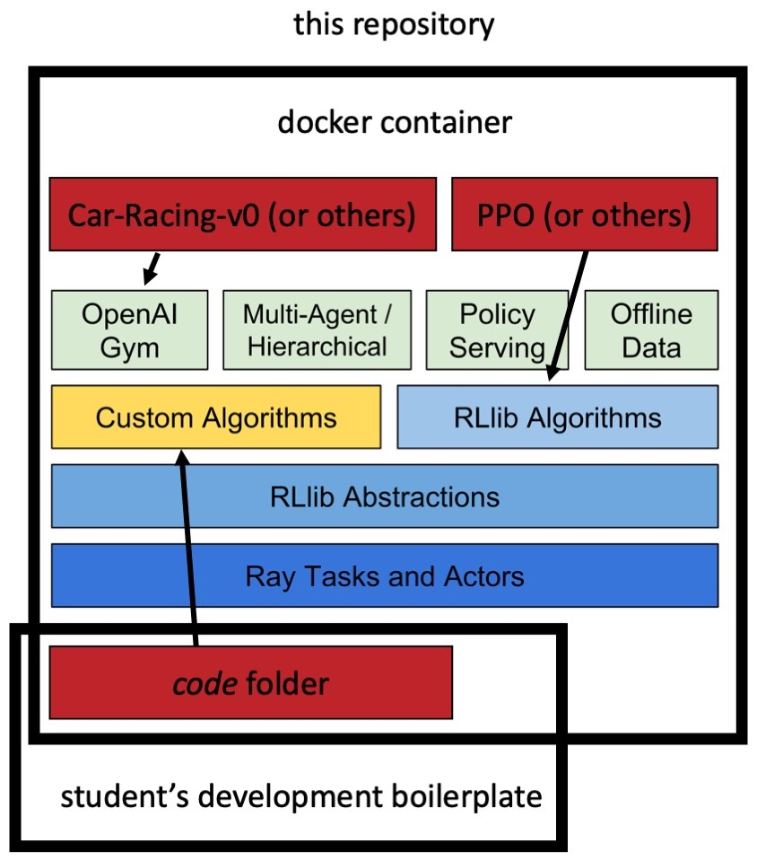

# General Information

* This project is based on Artur Niederfahrenhorst's master thesis, which investigated usage of recurrent cells in PPO.
Prior to Artur, a series of theses had been absolved by student of Shawan Mohamed, which were all centered around
PPO and the CarRacing-v0 environment by OpenAI. This project encapsulates some of the achievements of previous work
at the ICE in a Docker Container that is based on [Ray and RLLib](docs.ray.io/). RLLib is Ray's Reinforcement Learning
library.

* With this project, we hope to achieve some abstraction from previous work and provide a boiler plate for future theses.
Since work has "piled up" and is harder to see through now. 
Hopefully, future students can work with Ray, RLlib and code from previous work in a structured way.

* To understand how to use this repository, Ray, RLlib and possibly older code, there are five main resources: this 
README-file, documentation inside the code, the [Ray and RLLib documentation](https://docs.ray.io/),
[Angelo Mihaltan's master thesis](https://pub-gitlab.iss.rwth-aachen.de/ShawanMohammed2/angelo_ma),
[Artur Niederfahrenhorsts's master thesis](https://pub-gitlab.iss.rwth-aachen.de/niederfahrenhorst/master-thesis-artur-niederfahrenhorst).
For access to older repositories, also to Kemal's/Hendrik's Master thesis, ask Shawan.
For a deeper understanding of Ray, maybe also have a look at the tutorials at [Anyscale](https://anyscale.dev/).


\[ Illustration: Altered version of an image taken from the Ray documentation website. \]
# Scope

This repository aims to make it easier for future students to write a thesis that complies with Shawan's guidelines and 
the guidelines of the ICE. It may also make future work more productive. Future students can re-use old code, 
build upon it, or replace it with their own algorithms and neural networks. 

# Install and run

To start working, you should have docker installed. In case you do not know how to work with docker, spend a few hours
on the official docker tutorials first, it will save you lots of time and is an important skill anyways.

```
bash build_docker.sh
```

This will take some time and build your docker image from the current official ray docker image.
Incase you want to access open windows (such as simulation visualizations) inside the Docker container, you need an X-Client. 

## Windows:
* Download [VcXsrv for Windows](https://sourceforge.net/projects/vcxsrv/)
* Disable *access control* in the Extra Settings
```
sh launch_docker.sh -d <your own IP address goes here>
```
If you can not use Gygwin or something similar, work through *launch_docker.sh* to gain an understanding on how you can
get around the above instruction and update this README if with your knowledge.

## OSX:
* Download [XQuartz for OSX](https://www.xquartz.org/)
* For XQuartz: Enable *Allow connections from networks clients* in the Security Settings
```
xhost + localhost
bash launch_docker.sh -o
```

You may want to increase the maximum memory size for your containers from the daemon's side. RLLib uses a shared memory
object store, which may take up multiple gigabytes of memory, depending on your task

## Other OSs:
* You will have to help yourself.


# Running headless

You can run any simulations that open windows on your machine inside the container with xvfb-run:
For example:
```
xvfb-run -s "-screen 0 1400x900x24" python main.py
```

# Understand the file structure of the project

This sections describes how to approach this project if you want to understand or develop it.
The code is documented with docstrings and contains numerous references to sources that were used to develop it.

The code resides in the *code* folder and is structured as follows:

* ArtificialNeuralNetwork.py - Definition of the tensorflow ANN structure
* ConfigUtils.py - Interface for yaml configuration files for this project
* CustomModel.py - Custom RLLib TFModelV2 that wraps around our custom ANN
* Preprocessing.py - Read, write and manipulate datasets for this project
* Environment.py - A custom CarRacing-v0 environment, space for other environments
* Policy.py - A set of functions to extend the RLLib APPO Policy object with
* Training.py - A custom tune training execution flow
* VAE.py - A standalone variational autoencoder with training functions
* VAEThread.py - A seperate thread that trains a VAE on experiences generated by the APPO algorithm
* config.yaml - A configuration file that serves as the baseline configuration for this project, most parameters 
adopted from Angelo
* tune_config.yaml - Configuration parameters for Ray tune
* main.py - Main entry point to run this project

The code folder is mounted as a volume in the docker container. You can therefore develop in the code with an IDE of 
your choice and run your code inside the container. 

The sequential structure of the ANN is discussed in Angelo's master thesis.
As for the optimization algorithm, RLLib's APPO was extended by the VAE Loss from Angelos thesis.
*Policy.py* and *Model.py* are where this extension happens and should be understood first to grasp the core mechanisms of Artur's thesis.
*ArtificialNeuralNetwork.py and config.yaml, Environment.py, Trainable.py, Config.py, Preprocessing.py* can be left alone at first, but if explored, should be explored in the order as they appear in this sentence.

# Adding another environment
This project comes with two environments preconfigured: CarRacing-v0 and PongNoFrameskip-v4.
You can add other environments by setting the *ENVIRONMENT_FOLDER_NAME* parameter in *config/general_config.yaml*.
The folder should also be the name of your environment and contain *at least* a file called *Environment.py*.
The naming convention of the other, optional, files and what they should or may contain can be seen in the 
*config/CarRacing-v0* folder. Do not forget to declare your user-specified classes in *__ init __.py*.


# Issues with tensorflow versioning:

* Like the requirements.txt state: tensorflow==2.3.0 is needed. 2.4.X will cause memory issues for the VAE. 
* Issues with tensorflow and cuda libraries? See ...
    * ... [here](https://www.tensorflow.org/install/gpu) (pip install tensorflow==2.3.0 and cuda-10.1 and 10.2 afterwards) 
    * ... and [here](https://github.com/tensorflow/tensorflow/issues/26182#issuecomment-685234832) 


# Built With ...

* [TensorFlow2](https://www.tensorflow.org) - "TensorFlow is an end-to-end open source platform for machine learning."
* [Ray](https://docs.ray.io/en/latest/) - "Ray is a fast and simple framework for building and running distributed applications."
* [RLLib](https://docs.ray.io/en/latest/rllib.html) - "RLlib is an open-source library for reinforcement learning that offers both high scalability and a unified API for a variety of applications."
* [Tune](https://docs.ray.io/en/latest/tune.html) - "Tune is a Python library for experiment execution and hyperparameter tuning at any scale."


# Authors

* **Shawan Mohammed, MSc.** - *Supervision in development* - [ISS RWTH](https://www.ice.rwth-aachen.de/institute/staff/scientific-staff/shawan-mohammed/)
* **Artur Niederfahrenhorst, Msc.** - *Development* - [ISS RWTH](https://www.ice.rwth-aachen.de/institute/student-members/student-assistants/#ArturNiederfahrenhorst)

