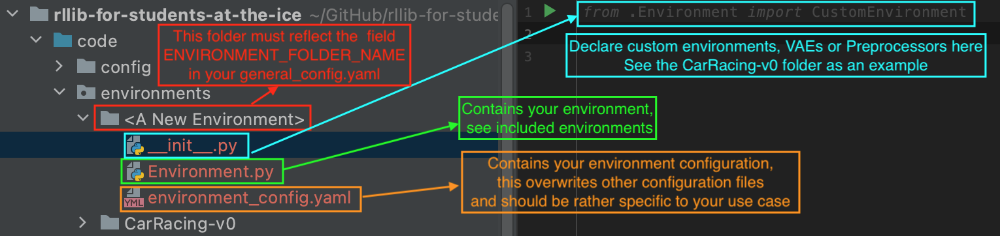

# General Information

This project focuses on using Deep Reinforcement Learning (DRL) 
to control an autonomous vehicle in hyper-realistic urban simulations.
The main contribution of our work lies in scaling DRL to the complex problem of autonomous driving under realistic conditions. 

The full release of the entire framework will appear shortly with the publication of the paper.

In the future, we plan to add more scientific DRL work to this repository. 
We will also clearly define standard tasks for autonomous driving and make them available for solution. 
In addition to LGSVL, other hyperrealistic simulations will also be integrated, such as Carla

# Install and run

This work used Anyscale's RLlib framework.
So before you start working on this repository, you should spend a few hours with the original [Ray repository from Anyscale](https://github.com/ray-project).
You will find there sample code for understanding and a very good [documentation](https://docs.ray.io/en/latest/)

# Understand the file structure of the project

This sections describes how to approach this project if you want to understand or develop it.
The code is documented with docstrings and contains numerous references to sources that were used to develop it.

The code resides in the *code* folder and is structured as follows:

* ArtificialNeuralNetwork.py - Definition of the tensorflow ANN structure
* ConfigUtils.py - Interface for yaml configuration files for this project
* CustomModel.py - Custom RLLib TFModelV2 that wraps around our custom ANN
* Preprocessing.py - Read, write and manipulate datasets for this project
* Environment.py - A custom CarRacing-v0 environment, space for other environments
* Policy.py - A set of functions to extend the RLLib APPO Policy object with
* Training.py - A custom tune training execution flow
* VAE.py - A standalone variational autoencoder with training functions
* VAEThread.py - A seperate thread that trains a VAE on experiences generated by the APPO algorithm
* config.yaml - A configuration file that serves as the baseline configuration for this project, most parameters 
adopted from Angelo
* tune_config.yaml - Configuration parameters for Ray tune
* main.py - Main entry point to run this project

# Adding another environment
This project comes with two environments preconfigured: CarRacing-v0 and PongNoFrameskip-v4.
You can add other environments by setting the *ENVIRONMENT_FOLDER_NAME* parameter in *config/general_config.yaml*.
The folder should also be the name of your environment and contain *at least* a file called *Environment.py*.
The naming convention of the other, optional, files and what they should or may contain can be seen in the 
*config/CarRacing-v0* folder. Do not forget to declare your user-specified classes in *__ init __.py*.

# Issues with tensorflow versioning:

* Like the requirements.txt state: tensorflow==2.3.0 is needed. 2.4.X will cause memory issues for the VAE. 
* Issues with tensorflow and cuda libraries? See ...
    * ... [here](https://www.tensorflow.org/install/gpu) (pip install tensorflow==2.3.0 and cuda-10.1 and 10.2 afterwards) 
    * ... and [here](https://github.com/tensorflow/tensorflow/issues/26182#issuecomment-685234832) 

# Built With ...

* [TensorFlow2](https://www.tensorflow.org) - "TensorFlow is an end-to-end open source platform for machine learning."
* [Ray](https://docs.ray.io/en/latest/) - "Ray is a fast and simple framework for building and running distributed applications."
* [RLLib](https://docs.ray.io/en/latest/rllib.html) - "RLlib is an open-source library for reinforcement learning that offers both high scalability and a unified API for a variety of applications."
* [Tune](https://docs.ray.io/en/latest/tune.html) - "Tune is a Python library for experiment execution and hyperparameter tuning at any scale."

# Authors

* **Shawan Mohammed, MSc.** - *Supervision in development* - [ISS RWTH](https://www.ice.rwth-aachen.de/institute/staff/scientific-staff/shawan-mohammed/)
* **Artur Niederfahrenhorst, Msc.** - *Development* 
* **Mohamed Kastouri, Msc.** - *Development* 
